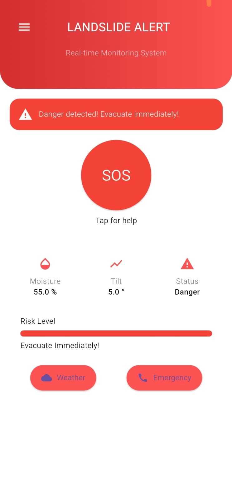
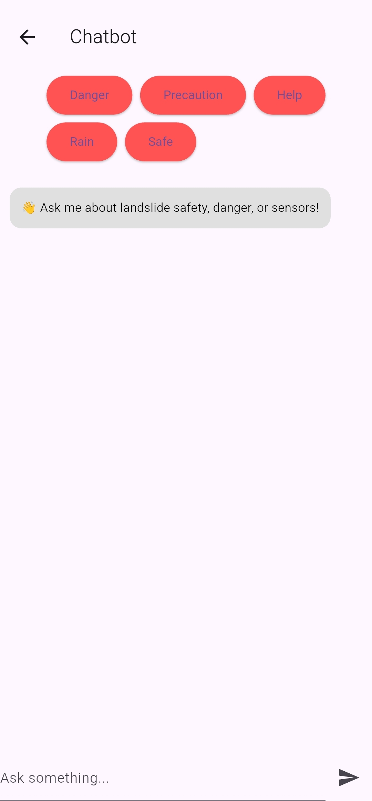
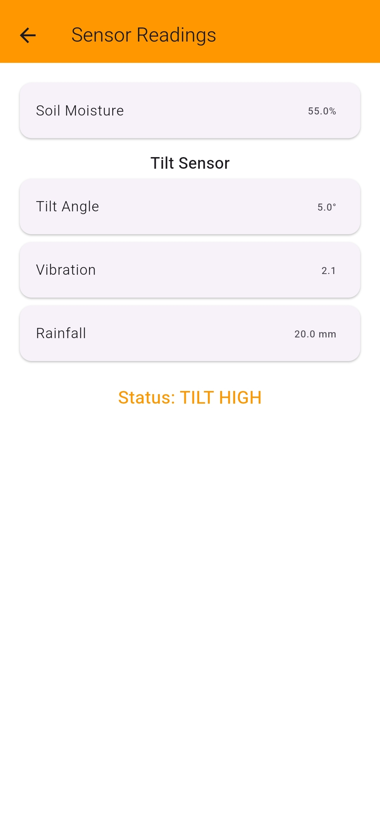
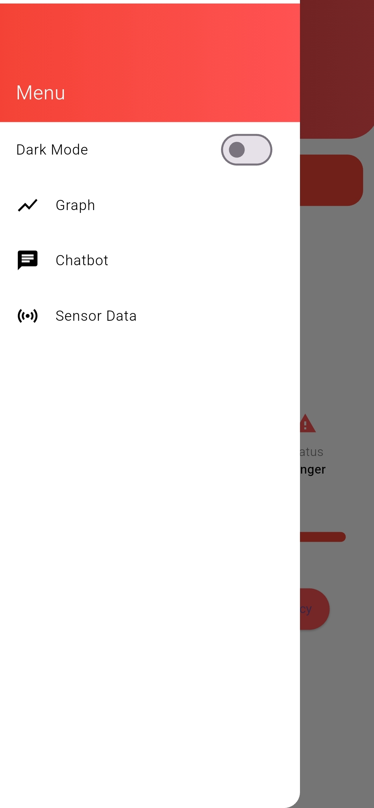

# IoT Based Landslide Detection and Alert System

## Overview
This project is a real-time landslide monitoring and alert system developed using Flutter, ESP32, and Node.js.

The system monitors environmental conditions using sensors and provides alerts through a mobile application.

---

## Features

- Real-time sensor monitoring
- Soil moisture detection
- Rain detection
- Tilt and vibration monitoring
- Graph visualization
- Emergency alerts
- Chatbot support
- Live sensor data updates

---

## Technologies Used

### Frontend
- Flutter
- Dart

### Backend
- Node.js
- Express.js

### Hardware
- ESP32
- Soil Moisture Sensor
- Tilt Sensor
- Vibration Sensor

---

## Project Structure

---

## How It Works

1. Sensors collect environmental data.
2. ESP32 sends data to backend server.
3. Backend processes sensor values.
4. Flutter app displays live readings and alerts.

---

## Screenshots

### Login Screen

### Dashboard

### Alert popup

### Chatbot

### Sensor Readings

### Drawer 

---

## Future Improvements

- AI prediction system
- GPS integration
- Cloud deployment
- Push notifications

---

## Author

Abhishek Krishnan
B.Tech Computer Science Engineering